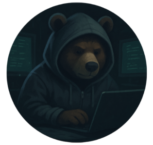

## Kesako

Open source CTF platform to host challenges.
If you're searching a self hosted solution to create CTF events

## Features

- Run with Docker & Docker Compose
- Deploy Dockerfile based challenges
- GitOps way to store challenges with an universel scheme
- Dynamic synchronization on challenges
- 👯 Teams & badges/awards systems
- ✍️ Fully customizable !
- 🔥 Deploy Docker Compose based challenges (WIP)

## Installation & usage

[Installation wiki link](https://github.com/h0lm0/pwnthemall/wiki/Installation)
[Usage wiki link](https://github.com/h0lm0/pwnthemall/wiki/Usage)

## Credits

Some works that inspired this project:

- https://github.com/FrancescoXX/go-fullstack-app
- https://github.com/CTFd/CTFd
- https://github.com/TheFlash2k/CTFd-CLI
