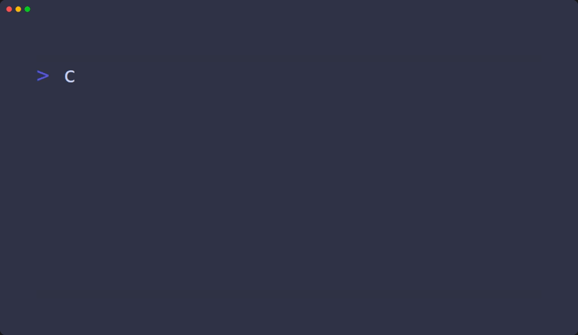

# pwnthemall

> Open-source **Capture The Flag (CTF)** platform to host, manage, and deploy your own cybersecurity challenges.  
> Designed for self-hosted events and built with modern tools, it makes running CTFs fun and efficient.

## 🚀 Features

- 🐳 Runs with **Docker** & **Docker Compose**
- 📦 Deploy **Dockerfile-based** challenges easily
- 🌎 Deploy **Geoint** challenges
- 📁 **GitOps-style** challenge management with a universal folder structure
- 🔄 **Real-time synchronization** of challenge metadata
- 👯 Team support with **badges & awards**
- ✍️ **Fully customizable** front-end and back-end

## 🚧 Work In Progress

- Support for **Docker Compose-based challenges** *(WIP)*
- Supporting multi workers
- Supporting KVM workers

## 📚 Installation & Usage

Check out the official documentation:

- 🔧 [Installation Guide](https://github.com/h0lm0/pwnthemall/wiki/I-%E2%80%90-Installation)
- 🕹️ [Usage Guide](https://github.com/h0lm0/pwnthemall/wiki/II-%E2%80%90-Usage)

## 🧠 Credits & Inspiration

The project is inspired by the amazing work of the following open-source projects:

- [FrancescoXX/go-fullstack-app](https://github.com/FrancescoXX/go-fullstack-app)
- [CTFd/CTFd](https://github.com/CTFd/CTFd)
- [TheFlash2k/CTFd-CLI](https://github.com/TheFlash2k/CTFd-CLI)

## ❤️ Contribute

Issues and pull requests are welcome!  
If you want to help shape the future of CTF hosting, join us!

